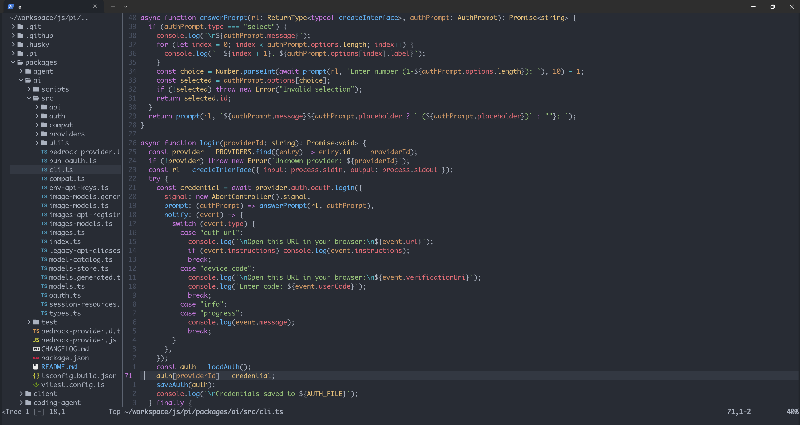

## Prerequirement

这套配置不是零依赖，启动前至少需要把下面几类环境准备好：

- `Neovim >= 0.12`
  当前配置使用了 `vim.pack.add`、`vim.lsp.enable`、内建 `autocomplete` 和内建 Treesitter 接口，旧版本无法直接工作。
- `git` 和可访问 GitHub 的网络
  插件通过 `vim.pack.add` 从 GitHub 拉取，首次启动需要能正常 clone。
- 搜索/终端工具
  `Snacks.picker` 和日常终端工作流建议安装 `rg`、`fd`、`fzf`、`bat`、`jq`、`tree`、`lazygit`。

按当前配置启用的语言能力，还需要这些可执行文件在 `PATH` 中：

- JavaScript / TypeScript
  需要 `node`、`npm`、`tsc`、`biome`。其中 `tsc` 被当作 LSP 启动命令使用，`biome` 被 `conform.nvim` 用于 JS/TS/CSS/JSON 格式化。
- Python
  需要 `python3`、`uv`、`basedpyright`、`ruff`、`debugpy-adapter`。其中 `basedpyright` 和 `ruff` 用于 LSP / format / code action，`debugpy-adapter` 用于 DAP 调试。
- Go
  需要 `go`、`gopls`、`goimports`、`gofumpt`；如果要使用调试，还需要 `dlv`。
- Lua
  需要 `lua-language-server` 和 `stylua`。
- C / C++
  需要 `clangd`。
- Rust
  需要 `rust-analyzer`；如果还没装工具链，通常一并安装 `rustup`、`rust-src`。
- Dart
  配置里启用了 `dartls`，只有在你确实开发 Dart / Flutter 时才需要安装 `dart` / `flutter` 并确保 `dartls` 可用。

另外，这套配置没有使用 `nvim-treesitter` 插件，而是假定 parser 会手动放在 `~/.config/nvim/parser/` 下。若要让折叠、高亮和 `after/queries/*` 里的自定义查询真正生效，需要提前准备对应语言的 Treesitter parser。

下面脚本可运行在Linux/MacOS环境，并且使用 Homebrew + `nvm` + `uv`：

```bash
# 1. 安装 Homebrew（如果还没有）
/bin/bash -c "$(curl -fsSL https://raw.githubusercontent.com/Homebrew/install/HEAD/install.sh)"
echo 'eval "$(/home/linuxbrew/.linuxbrew/bin/brew shellenv zsh)"' >> ~/.zshrc
eval "$(/home/linuxbrew/.linuxbrew/bin/brew shellenv zsh)"

# 2. 安装基础命令行工具和 Neovim
brew install neovim git ripgrep fd fzf bat jq tree lazygit xxd

# 3. 安装 Node.js（通过 nvm）
curl -o- https://raw.githubusercontent.com/nvm-sh/nvm/v0.40.6/install.sh | bash
source ~/.zshrc
nvm install 24
nvm use 24

# 4. 安装常用语言运行时 / 工具链
brew install go lua-language-server stylua llvm cmake
curl -LsSf https://astral.sh/uv/install.sh | sh
source ~/.zshrc
curl --proto '=https' --tlsv1.2 -sSf https://sh.rustup.rs | sh
. "$HOME/.cargo/env"
rustup component add rust-analyzer
rustup component add rust-src

# 5. 安装 JS / TS 工具
npm install -g typescript
npm install -g @biomejs/biome

# 6. 安装 Python 工具
uv tool install basedpyright
uv tool install ruff@latest
uv tool install debugpy

# 7. 安装 Go 工具
go install golang.org/x/tools/gopls@latest
go install golang.org/x/tools/cmd/goimports@latest
go install mvdan.cc/gofumpt@latest
go install github.com/go-delve/delve/cmd/dlv@latest
```

补充说明：

- 剪贴板
  `vimrc` 里设置了 `clipboard=unnamedplus`。检测到 SSH 会话（`$SSH_CONNECTION` / `$SSH_CLIENT` / `$SSH_TTY`）时会改用 OSC 52（`g:clipboard = 'osc52'`），需要终端支持 OSC 52 才能工作；本机环境下则依赖系统剪贴板 provider，若Linux环境下 `clipboard=unnamedplus` 不生效，补装 `xclip`（X11）或 `wl-clipboard`（Wayland）即可。
- JavaScript / TypeScript 调试
  当前 DAP 配置把 `js-debug` 固定写在 `/opt/js-debug/src/dapDebugServer.js`。按照 `history.txt`，可以这样安装：

```bash
wget https://github.com/microsoft/vscode-js-debug/releases/download/v1.117.0/js-debug-dap-v1.117.0.tar.gz
tar -xvf js-debug-dap-v1.117.0.tar.gz
sudo mkdir -p /opt/js-debug
sudo cp -r js-debug/* /opt/js-debug/
```

- Dart / Flutter
  配置里启用了 `dartls`。如果不开发 Dart / Flutter，可以先忽略；如果需要，再单独安装 `dart` 或 Flutter SDK 并确认 `dartls` 在 `PATH` 中。
- Treesitter parser
  这套配置没有自动安装 parser。你需要自行把对应语言的 parser 放到 `~/.config/nvim/parser/`，否则自定义 query 虽然存在，但不会完整生效。

## 结构

```txt
~/.config/nvim/
├── init.lua                 # 入口文件，只负责按序加载其他模块
├── vimrc                    # 通用 vim 设置，由 init.lua 先 source
├── nvim-pack-lock.json      # vim.pack.add 的插件版本锁定文件
├── stylua.toml              # Stylua 格式化配置
├── .luarc.jsonc             # Lua LSP (lua-language-server) 配置
├── parser/                  # 手动放置的 Treesitter parser (*.so)
├── after/
│   ├── lsp/                 # 各语言 LSP 启动参数与补丁
│   │   ├── basedpyright.lua
│   │   ├── gopls.lua
│   │   ├── lua_ls.lua
│   │   ├── ruff.lua
│   │   └── tsc.lua
│   └── queries/             # 自定义 Treesitter query（折叠/高亮/缩进/注入/局部变量）
│       ├── css/  ecma/  go/  html/  html_tags/
│       ├── javascript/  jsx/  typescript/  tsx/
│       └── python/  rust/
├── lua/
│   ├── core/                # 核心配置
│   │   ├── options.lua      # 基础设置 (vim.opt)
│   │   ├── keymaps.lua      # 快捷键映射（依赖插件）
│   │   ├── autocmds.lua     # 自动命令 (augroup)
│   │   ├── theme/           # 颜色主题与各语言高亮覆盖
│   │   │   ├── init.lua     #   主题入口，应用 colorscheme
│   │   │   ├── common.lua   #   通用高亮覆盖
│   │   │   └── <lang>.lua   #   css / html / javascript / json / jsx / less / lua / markup / python / tsx / typescript 等
│   │   ├── lsp/
│   │   │   ├── init.lua     #   LSP 通用配置与补丁
│   │   │   └── tsc.lua      #   TypeScript (tsc) LSP 配置
│   │   └── dap/             # 调试配置
│   │       ├── init.lua     #   DAP 入口
│   │       ├── go.lua       #   Go (dlv)
│   │       ├── python.lua   #   Python (debugpy)
│   │       ├── js.lua       #   JavaScript (js-debug)
│   │       ├── ui.lua       #   nvim-dap-ui
│   │       ├── highlights.lua
│   │       └── keymaps.lua
│   └── plugins/             # 插件安装与加载
│       ├── init.lua         #   vim.pack.add 声明插件并加载各模块
│       ├── nvim-tree.lua
│       ├── snacks.lua       #   Snacks.picker 等
│       ├── lsp.lua          #   nvim-lspconfig 配置
│       ├── conform.lua      #   conform.nvim 格式化
│       └── autotag.lua      #   nvim-ts-autotag
```

## 按键映射

配置里没有显式设置 `mapleader`，所以 `<leader>` 为 Neovim 默认值 `\`。以下映射来自 `lua/core/keymaps.lua`、`lua/core/autocmds.lua` 和 `lua/core/dap/keymaps.lua`。

### 文件 / 搜索（Snacks.picker）

| 按键 | 功能 |
| --- | --- |
| `<leader>ff` | 查找文件 |
| `<leader>fg` | grep 搜索 |
| `<leader>fb` | 列出缓冲区 |
| `<leader>fr` | 最近打开的文件 |
| `<leader>fs` | 工作区符号 |
| `<leader>s"` | 寄存器 |
| `<leader>s/` | 搜索历史 |
| `<leader>sa` | Autocmds |
| `<leader>sb` | 当前缓冲区行 |
| `<leader>sc` | 命令历史 |
| `<leader>sC` | 命令列表 |
| `<leader>sd` | 全部诊断 |
| `<leader>sD` | 当前缓冲区诊断 |
| `<leader>sH` | 高亮组 |
| `<leader>sk` | 键位列表 |
| `<leader>sq` | Quickfix 列表 |

### 文件树 / Git

| 按键 | 功能 |
| --- | --- |
| `<leader>tf` | 在文件树中定位当前文件 |
| `<leader>tt` | 开关文件树 |
| `<leader>gg` | 打开 Neogit |

### LSP（LSP 附加到缓冲区后可用）

| 按键 | 功能 |
| --- | --- |
| `K` | 悬停文档 |
| `gd` | 跳转到定义 |
| `gr` | 查找引用 |
| `gi` | 跳转到实现 |
| `<leader>rn` | 重命名符号 |
| `<leader>ca` | 代码操作 |

### 调试（DAP）

| 按键 | 功能 |
| --- | --- |
| `<leader>db` | 切换断点 |
| `<leader>dB` | 条件断点 |
| `<leader>dc` | 继续 / 开始调试 |
| `<leader>dC` | 运行到光标处 |
| `<leader>do` | 单步跳过 |
| `<leader>di` | 单步进入 |
| `<leader>dO` | 单步跳出 |
| `<leader>dt` | 开关调试 UI |
| `<leader>dr` | 开关 DAP REPL |
| `<leader>dq` | 终止调试 |

### 自定义命令（来自 `vimrc`）

| 命令 | 功能 |
| --- | --- |
| `:CopyRelativeFilePath` | 复制当前文件相对路径 |
| `:CopyRelativeParentPath` | 复制当前文件所在目录相对路径 |
| `:CopyAbsoluteFilePath` | 复制当前文件绝对路径 |
| `:CopyAbsoluteParentPath` | 复制当前文件所在目录绝对路径 |
| `:CopyWorkspacePath` | 复制当前工作目录路径 |

## 致谢

这套配置引用了以下开源插件（通过 `vim.pack.add` 从 GitHub 安装），在此由衷感谢每一位插件开发者的付出：

- [onedarkpro.nvim](https://github.com/olimorris/onedarkpro.nvim) — `olimorris`，本配置使用的颜色主题。
- [nvim-web-devicons](https://github.com/nvim-tree/nvim-web-devicons) — `nvim-tree`，图标支持。
- [nvim-tree.lua](https://github.com/nvim-tree/nvim-tree.lua) — `nvim-tree`，文件树。
- [plenary.nvim](https://github.com/nvim-lua/plenary.nvim) — `nvim-lua`，通用工具库。
- [nvim-lspconfig](https://github.com/neovim/nvim-lspconfig) — `neovim` 团队，LSP 配置集合。
- [conform.nvim](https://github.com/stevearc/conform.nvim) — `stevearc`，格式化。
- [diffview.nvim](https://github.com/sindrets/diffview.nvim) — `sindrets`，diff / merge 视图。
- [baleia.nvim](https://github.com/m00qek/baleia.nvim) — `m00qek`，ANSI 着色。
- [neogit](https://github.com/neogitorg/neogit) — `neogitorg`，内嵌 Git 客户端。
- [nvim-dap-ui](https://github.com/rcarriga/nvim-dap-ui) — `rcarriga`，调试界面。
- [nvim-nio](https://github.com/nvim-neotest/nvim-nio) — `nvim-neotest`，异步 I/O 库，`nvim-dap-ui` 的依赖。
- [nvim-dap](https://github.com/mfussenegger/nvim-dap) — `mfussenegger`，DAP 调试框架。
- [nvim-dap-virtual-text](https://github.com/theHamsta/nvim-dap-virtual-text) — `theHamsta`，调试变量内联显示。
- [nvim-dap-go](https://github.com/leoluz/nvim-dap-go) — `leoluz`，Go 调试支持。
- [snacks.nvim](https://github.com/folke/snacks.nvim) — `folke`，picker 等通用工具集。
- [nvim-ts-autotag](https://github.com/windwp/nvim-ts-autotag) — `windwp`，HTML/JSX 标签自动闭合。
